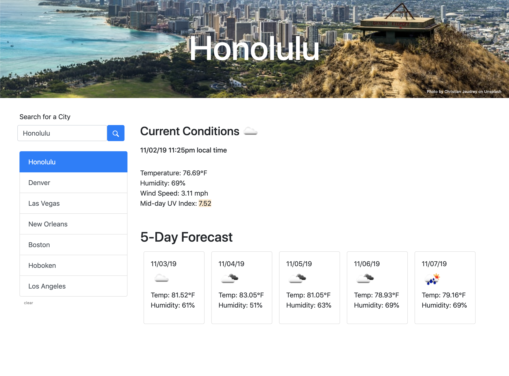

# 06-weather-dashboard
## Unit 06 Server-Side APIs Homework: Weather Dashboard

A responsive and dynamic weather dashboard built with HTML, CSS, Javascript, Bootstrap, jQuery, Moment.js, and the browser's localStorage.

Data from OpenWeather API & Unsplash API proxied via [Netlify Redirects](https://docs.netlify.com/routing/redirects/).

Live Site: [https://znode-weather-dash.netlify.app](https://znode-weather-dash.netlify.app) 

Deployed to [Netlify](https://www.netlify.com/)  

If the searched city is found on the OpenWeather current weather API endpoint, the 5 day forecast and UV index API endpoints are called, the city is saved to localStorage, and all the data is rendered to the page. Additionally, an image related to the city's name is returned from the Unsplash API and applied to the header background.

